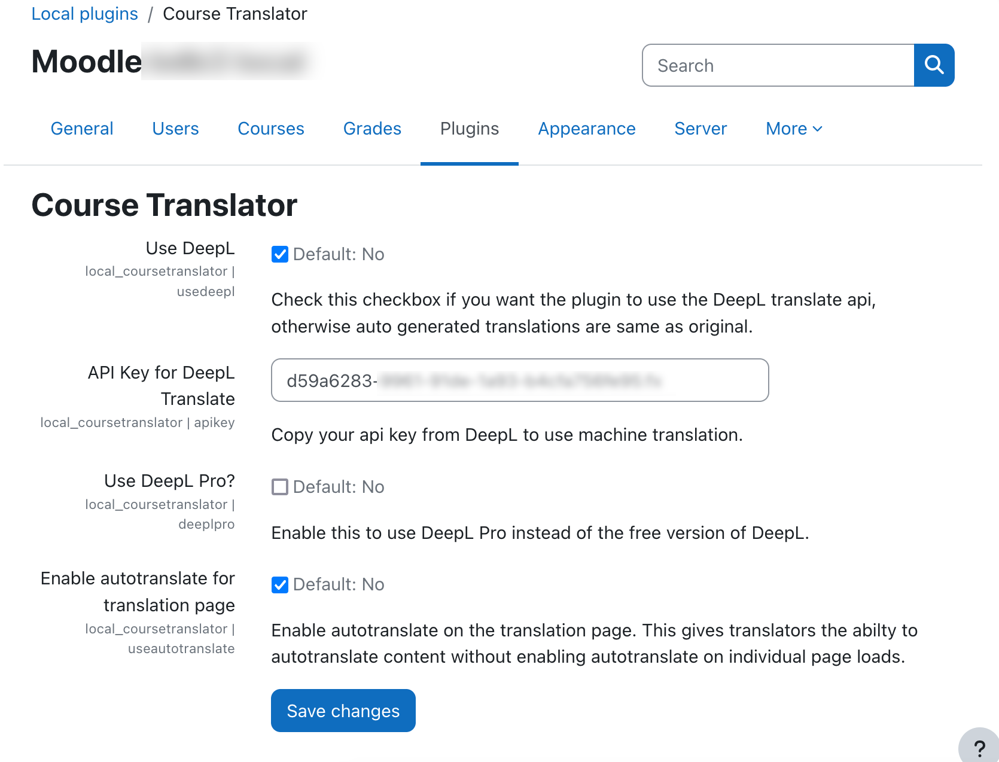
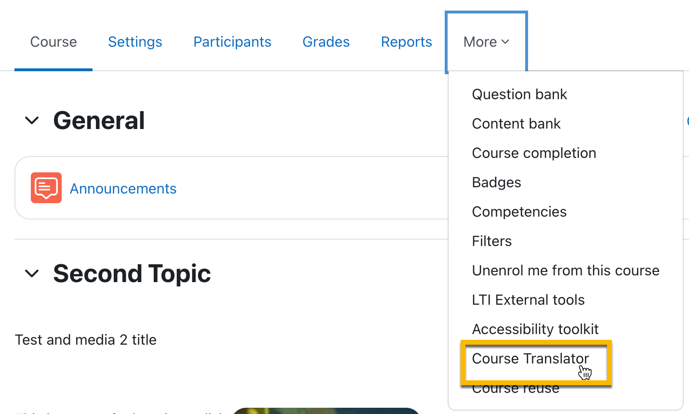
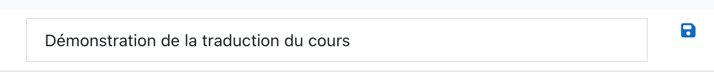
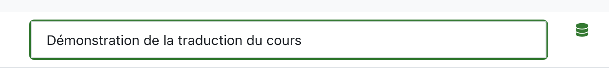
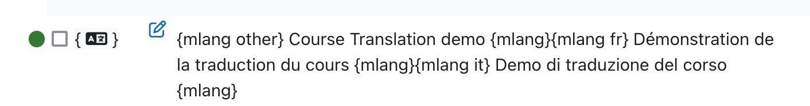
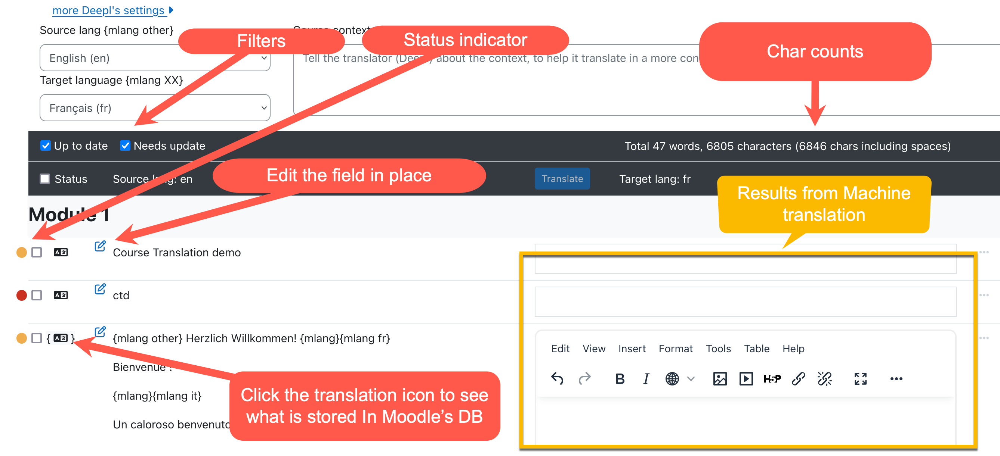

# Course Translator for Moodle

[](https://github.com/brunobaudry/moodle-local_coursetranslator/actions/workflows/moodle-ci.yml) [](https://github.com/brunobaudry/moodle-local_coursetranslator/actions/workflows/dependency-review.yml) [](https://sonarcloud.io/summary/new_code?id=jamfire_moodle-local_coursetranslator)

Course Translator is a local moodle plugin that provides a content translation page for courses and automatic machine translation using the DeepL Pro Translation api. Currently it
can translate content two levels deep and is developed for those who want to translate a course all on one page without having to navigate to each module and update
translations.
Translation workflow being the following:

0. Fine tune your Deepl's settings.
1. Select the source language.
2. Select the target language.
3. Select the fields to translate.
4. Send to Deepl.
5. Review and or amend automated translations.
6. Save translations to Moodle's DB.

[Multi-Language Content (v2)](https://moodle.org/plugins/filter_multilang2) is a dependency of this plugin and will not work without it.

## Installation

Clone or download this plugin to ```/moodlewww/local/coursetranslator``` and run through the database upgrade process.

## Configuration

Course Translator will extend Moodle with the ```local/coursetranslator:edittranslations``` capability. Assign the capability to a new Translator role or add it to one of your
existing roles. It will also add a ```local_coursetranslator_update_translation``` web service for the translation page to perform ajax requests against.

To configure the plugin, navigate to **Site Administration -> Plugins -> Local plugins -> Manage local plugins.** From this page you can configure DeepL settings, specify wether
you are using DeepL API Free or Deepl API Pro, and enable/disable the autotranslate feature on the translation page. Visit
the [DeepL API page](https://developers.deepl.com/docs/getting-started/readme) to
signup for an api key that you can enter into local plugin settings.



## Translating Content

To begin translating content, visit a course, open the course settings action menu, and then go to **Course Translator**.



You will be sent to the translation page for the course.

### Source language

The source language will be set to the actual Moodle language selection which will automatically be set to **other**.
Changing the source language will act as if you'd change moodle's lang.
It is important, from a translation standpoint, to **select the source language from the language it was initially written** (and to stick with it).

When first translating your content the plugin will insert ```{mlang other}Your Content...{mlang}``` tags .
Please checkout the [mlang docs](https://moodle.org/plugins/filter_multilang2) to understand more.

### Target language

To change the language you want to translate to, choose a language from the **Target language {mlang XX}** dropdown.
Note: indeed you cannot translate from and to the same language so buttons and checkboxes would be disabled if so.

### Status indicator

Each row has a little colored dot to indicate a status:

- Red -> This field was never translated. (no {mlang} tag found)
- Orange -> This field was translated but there were some updates made in the Database. (Needs a review)
- Green -> The filed was already translated and up to date (in the target language).

### Filter

You can filter the rows to hide/show the ones that need to be translated as wished.
Clicking on the "Status" checkbox will select all visible.

### Translating

Once the row(s) selected (a little Hourglass displays ).
Click on the **Translate** button to send **all selected** fields to deepl and back.

### Reviewing translation

After the translation returned, a "save" displays on the right of the translated text (floppy icon  ).

After you reviewed and edited the machine translated text press the "save" floppy icon to store the translation in Moodle's DB.
You will see indicators that all went good.

Should there be any error when saving to the DB, an alert icon will display.

Double check that all went ok by toggling the "translation" icon and see the {mlang} tags inserted.




## WARNING

### Multi mlang xx tags inside a field

_At this time, Course Translator does not have the ability to translate advanced usage of mlang in content. For example, this includes the use of multiple mlang tags spread
throughout content that utilize the same language._

### Image display

_Currently images are only displayed in the preview but not in the text editor. Instead the alt attribute content is highlighted._

## Compatability

This plugin has been tested on Moodle 3.11 and Moodle 4.0.
Should work with the following editors:

- Plaintext
- Atto
- Tiny
- Marklar

## How does this plugin differs from Content Translation Manager and Content Translation Filter?

This plugin does not translate every string on your site. It is only meant for translating courses and it uses Moodle's built in multilingual features along with ```{mlang}``` to
translate your content. When you backup and restore courses, your translations will migrate with your content. Updating your source content will provide a "Update Needed" status
message on the course translation page.

## Future (todos)

- Question banks translation.
- Machine translation API abstraction to use other services than Deepl.
- Display images all times.
- Translations versioning.

## Submit an issue

Please [submit issues here.](https://github.com/jamfire/moodle-local_coursetranslator/issues)

## Changelog

See the [CHANGES.md](CHANGES.md) documentation.

## Contributing

See the [CONTRIBUTING.md](CONTRIBUTING.md) documentation.
